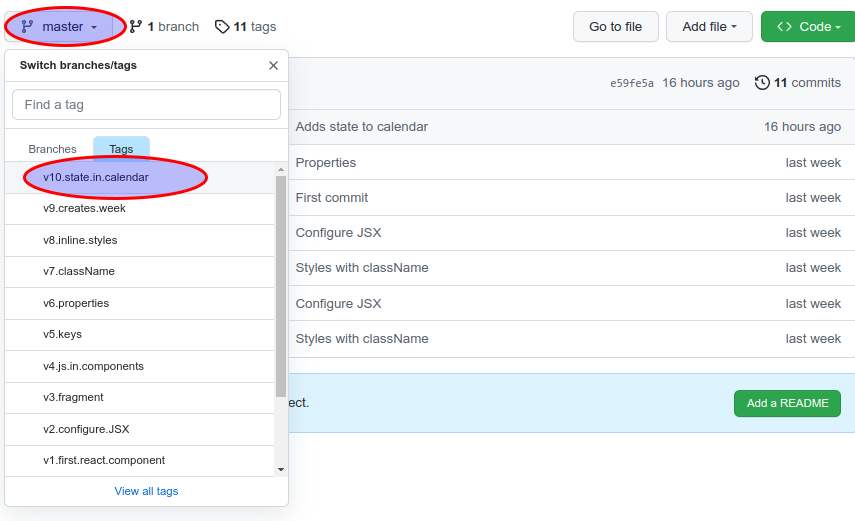

### Navigate through the examples
You can navigate between the code used in the different videos and examples using tags.

To get a version, just `git checkout vx.xxxx`. For example, to get the version used for properties just `git checkout v6.properties` (git should autocomplete the tag if you write the `vxx` part).

From GitHub, select the tag in the top left box:

Then, you can press "." to view the code online

